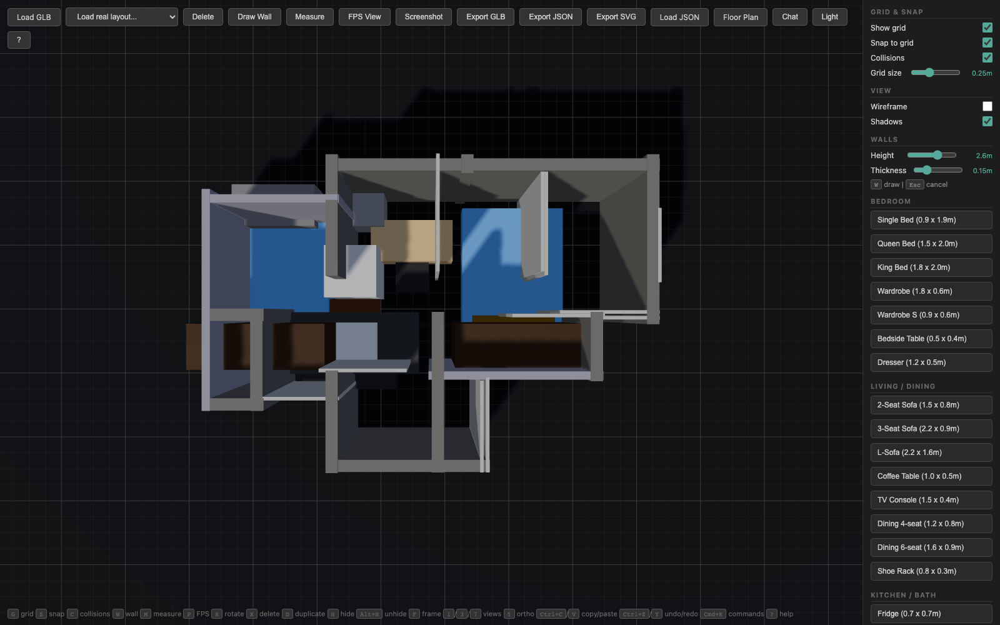
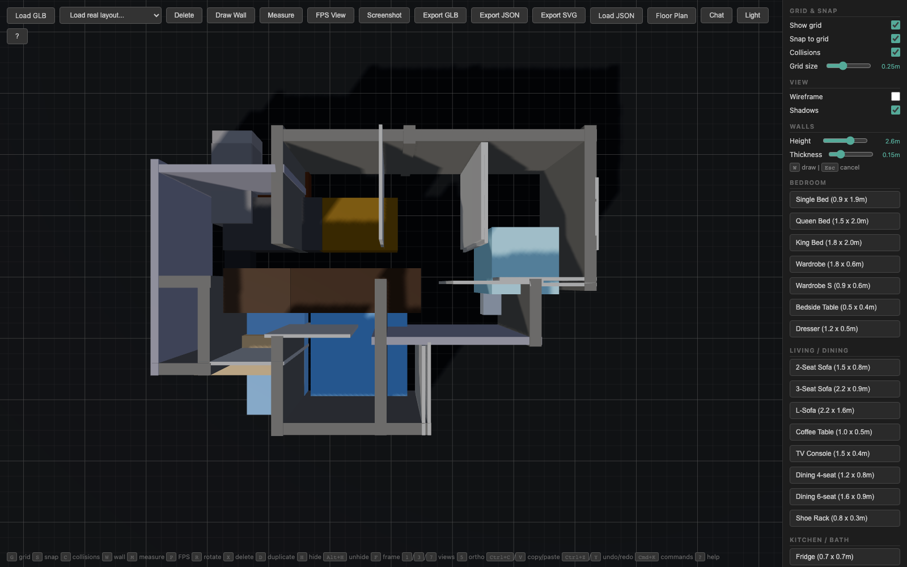
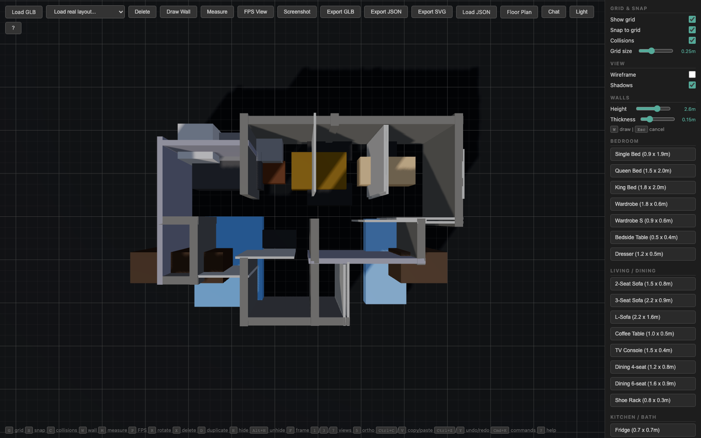

# Provider Benchmark

This benchmark captures one fixed-prompt run of the `Haus` MCP workflow across the free/API routes that were usable from this checkout on June 3, 2026.

Candidate routes were selected from [mnfst/awesome-free-llm-apis](https://github.com/mnfst/awesome-free-llm-apis), which lists OpenAI-compatible free inference options including [GitHub Models](https://models.github.ai/inference), [Kilo Code](https://api.kilo.ai/api/gateway), and [LLM7.io](https://api.llm7.io/v1). For this run, GitHub Models and LLM7 completed the tool-driven layout workflow reliably enough to compare.

## Fixed Prompt

```text
Benchmark prompt: design a minimalist 4-room family flat for a Singapore HDB/BTO layout. Start by inspecting the current layout. Then use tools to add real furniture, not just prose. Place a living area with sofa, coffee table, and TV console; a dining area; at least two bedrooms with beds and wardrobes; a study/work corner; and basic kitchen fixtures. Keep a clear circulation path through the flat where possible. Tag furniture into rooms. Run at least one spatial validation tool such as check_sightline or score_walkway before your final answer.
```

## Methodology

- Base layout: `corpus/library/2.json`, a 4-room yellow BTO floor plan from the included corpus.
- Each route received the same system instruction, prompt, base layout, and primitive tool set: `get_layout_summary`, `list_objects`, `list_furniture_catalog`, `add_furniture`, `tag_room`, `check_sightline`, and `score_walkway`.
- The harness executed real tool calls against the same local MCP layout functions. It did not allow the high-level `design_flat` shortcut.
- Tool use was forced until at least 8 furniture objects were placed. GitHub Models Mistral used provider-specific `tool_choice: "any"` because it rejected OpenAI's `tool_choice: "required"` value.
- Each finished layout was imported into the same browser viewer and captured in the same top-down 1600x1000 view.
- No direct `ANTHROPIC_API_KEY`, `OPENAI_API_KEY`, or `GEMINI_API_KEY` was present locally, so there is no direct Claude, OpenAI platform, or Gemini platform run here. DeepSeek via GitHub Models responded to plain chat but rejected tool use, and Kilo/OpenRouter-style free routing was inconsistent under this tool-heavy prompt.

## Results

| Route | Requested model | Reported model(s) | Furniture | Tool calls | Room tags | Validation result | Screenshot |
|---|---|---|---:|---:|---|---|---|
| GitHub Models / OpenAI GPT-4o mini | `openai/gpt-4o-mini` | `gpt-4o-mini-2024-07-18` | 14 | 24 | Bedroom 1, Bedroom 2, Dining Room, Kitchen, Living Room, Study | `check_sightline` reported the living-to-dining sightline blocked by 6 objects. | [PNG](./asset/benchmarks/github-models-gpt-4o-mini.png) |
| GitHub Models / Mistral Small | `mistral-ai/mistral-small-2503` | `mistral-small-2503` | 13 | 24 | Bathroom, Bedroom 2, Dining Room, Kitchen, Living Room, Master Bedroom, Study | `score_walkway` found a 0.01m narrowest gap and a 0.024 walkway score. | [PNG](./asset/benchmarks/github-models-mistral-small.png) |
| LLM7 free gateway | `mistral-small-3.1-24b` | `mistral-small-3.2`, `qwen3-235b` | 17 | 25 | Kitchen, Living and Dining, Master Bedroom, Second Bedroom, Study | `check_sightline` reported the sofa-to-TV sightline blocked by 7 objects. | [PNG](./asset/benchmarks/llm7-free-gateway.png) |

## Captured Outputs

### GitHub Models / OpenAI GPT-4o mini



### GitHub Models / Mistral Small



### LLM7 free gateway



## Observations

- GitHub Models / OpenAI GPT-4o mini produced the most evenly structured room tagging, but its own validation found a blocked sightline through the flat.
- GitHub Models / Mistral Small completed the same primitive workflow after the `tool_choice` adapter change, but it crowded the circulation path enough for `score_walkway` to flag a near-zero passable gap.
- LLM7 produced the largest furnishing set and completed the prompt without registration, but its gateway reported different backend model IDs across the run, so attribution should be treated as gateway-level rather than model-level.

## Caveats

- This is a workflow reliability comparison of free/API routes that were available during this run, not a statistically significant model leaderboard.
- Free gateways can rate-limit, silently route between backend models, or change model availability without notice.
- The screenshots compare top-down geometry only. They do not capture subjective design quality, material choices, or full 3D user experience.
- Direct Claude, OpenAI platform, and Gemini platform comparisons still require their corresponding provider keys.
